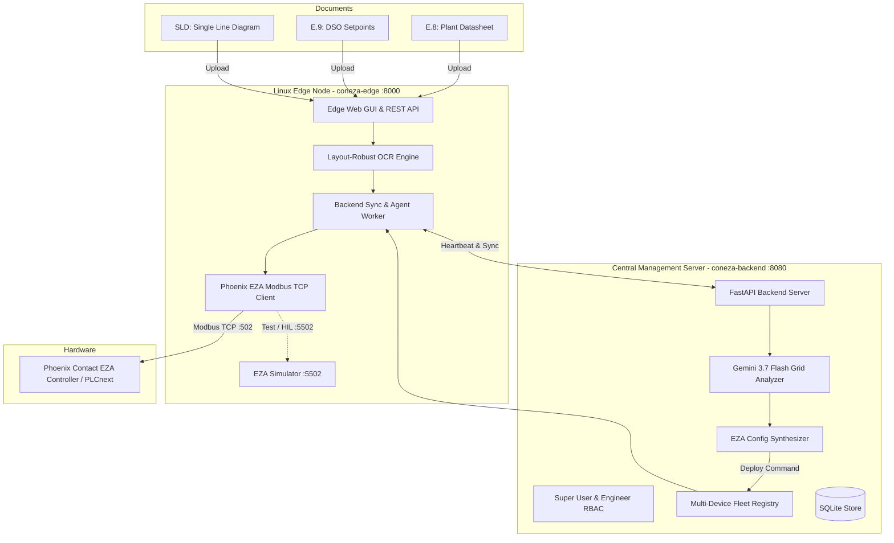

# coneza - Grid Interconnection & Phoenix Contact EZA Controller Platform

**coneza** is an industrial distributed edge-to-cloud power systems engineering platform built for renewable generation plants (Solar PV, Wind, BESS) connecting to Medium/High Voltage grids under **VDE-AR-N 4110 / VDE-AR-N 4120**.

It receives grid interconnection documentation—**Form E.8** (plant/storage datasheet), **Form E.9** (grid operator query sheet & setpoints), and **SLD** (Single Line Diagram schematic)—processes varied document layouts with **layout-robust OCR**, analyzes the engineering specifications using **Gemini 3.7 Flash**, and directly configures the **Phoenix Contact EZA-Regler** (Power Plant Controller / PLCnext SOL-SC-PCU) over **Modbus TCP**.

---

## Key Features

1. **Linux Edge Webserver (`coneza-edge`)**:
   - Designed to run on industrial Linux edge gateways (e.g. Phoenix Contact EPC 1502 / EPC 1522, Raspberry Pi CM4, Moxa, Advantech, or standard Linux boxes).
   - Ingests **E.8**, **E.9**, and **SLD** files locally via web GUI, USB, or REST API.
   - Built-in multi-tier OCR engine (digital vector extraction, image OCR fallback, and German/European grid layout normalization).
   - Direct Modbus TCP connection to Phoenix Contact EZA-Regler (holding registers, telemetry, and read-back verification).
   - Built-in Hardware-in-the-Loop (HIL) Modbus TCP simulator on port 5502 for zero-hardware testing.

2. **Central Backend & Fleet Manager (`coneza-backend`)**:
   - Role-Based Access Control (**RBAC**):
     - **`SUPER_ADMIN` (Super User)**: Local multi-device access, provisions new Linux edge devices across plant subnets, approves EZA configurations, commands deployments, and manages users.
     - **`ENGINEER`**: Uploads documents, triggers Gemini grid analyses, inspects discrepancies, and drafts configurations.
     - **`VIEWER`**: Read-only telemetry, document viewing, and audit inspection.
   - Central multi-device registry tracking heartbeats, live telemetry ($P$, $Q$, $U$, $f$), and controller states.

3. **Gemini 3.7 Flash Grid Analysis Engine**:
   - Ingests OCR extracted text and schematics from E8, E9, and SLD documents.
   - Cross-validates plant inverter capacity against transformer MVA ratings.
   - Evaluates grid operator active feed-in limits ($P_{AV}$) against installed capacity ($P_{inst}$).
   - Verifies reactive power capabilities against mandated $Q(U)$ voltage support curves or $\cos\varphi(P)$ modes.
   - Synthesizes exact Phoenix Contact EZA Modbus register tables ready for commissioning.

4. **Phoenix Contact EZA Controller Commissioning**:
   - Automated register translation: active power limits ($P_{set}, P_{AV}$), ramp rates, $Q(U)$ 4-point curves ($U_1..U_4, Q_1..Q_4$), frequency response $P(f)$, and protection trip times ($U_{>}, U_{<}, f_{>}, f_{<}$).
   - Atomic read-back verification ensuring 100% parameter compliance before plant energization.
   - Emergency circuit breaker trip command ($Q_0$).

---

## System Architecture



---

## Phoenix Contact EZA-Regler Register Map

The controller driver communicates via standard Modbus TCP (Function Codes `03`, `04`, `06`, `16`):

| Address (Base 0) | Holding Register Name | Unit / Scaling | Description |
|---|---|---|---|
| `0` | `REG_SYSTEM_STATUS` | `1=Run, 0=Standby` | Master system operational state |
| `3` | `REG_GRID_VOLTAGE_NOMINAL` | `V` (e.g. 20000) | Nominal medium voltage ($U_n$) |
| `5` | `REG_RATED_ACTIVE_POWER_KW` | `kW` (e.g. 2500) | Plant rated active power ($P_r$) |
| `6` | `REG_RATED_APPARENT_POWER_KVA` | `kVA` (e.g. 2750) | Plant apparent power ($S_r$) |
| `101` | `REG_P_SETPOINT_KW` | `kW` | Target active power feed-in setpoint |
| `103` | `REG_P_MAX_FEED_IN_LIMIT_KW`| `kW` | DSO grid connection limit ($P_{AV}$) |
| `104` | `REG_P_RAMP_RATE_KW_PER_SEC`| `kW/s` | Maximum active power ramp gradient |
| `200` | `REG_Q_CONTROL_MODE` | `0=cosPhi, 1=Q(U), 2=Qfix` | Mandated reactive power mode |
| `201` | `REG_COS_PHI_SETPOINT` | `x1000` (e.g. 950 = 0.95) | Fixed power factor setpoint |
| `220` - `227` | `REG_QU_U1` .. `REG_QU_Q4` | `0.1% Un` / `0.1% Qmax` | $Q(U)$ 4-point characteristic curve |
| `300` - `303` | `REG_PF_OVERFREQ_START` .. | `0.01 Hz` / `0.1% droop` | $P(f)$ frequency-dependent active power |
| `400` - `405` | `REG_PROT_U_MAX_PERCENT` .. | `0.1% Un` / `ms` | Voltage & frequency decoupling protection |
| `500` | `REG_CMD_CIRCUIT_BREAKER` | `1=Close, 2=Trip` | Circuit breaker control command |

---

## Quick Start & Installation

### 1. Requirements
- Python 3.10+
- Linux (for edge deployment) or Windows / macOS (for development & testing)

### 2. Local Setup
```bash
# Clone or navigate to the directory
cd coneza

# Create and activate virtual environment
python -m venv .venv
source .venv/bin/activate  # On Windows: .venv\Scripts\activate

# Install dependencies
pip install -r requirements.txt
```

### 3. Generate Sample Documents
To generate test PDFs conforming to VDE-AR-N 4110:
```bash
python samples/generate_sample_documents.py
```
This produces:
- `samples/sample_E8_datasheet.pdf` (2.5 MW Solar + 1 MWh BESS)
- `samples/sample_E9_commissioning.pdf` (Bayernwerk Netz GmbH DSO Protocol)
- `samples/sample_SLD_schematic.pdf` (Single Line Diagram vector drawing)

### 4. Running the Central Backend
- **Local Dev**:
  ```bash
  python backend/main.py
  ```
  Access Dashboard: [http://localhost:8080](http://localhost:8080)

- **Production Docker Container (e.g. on your public webserver)**:
  ```bash
  docker compose -f docker/docker-compose.backend.yml up -d
  ```
  Accessible publicly on port **`9080`** (avoiding 80, 443, 8080):
  - **Live URL**: `http://195.90.215.204:9080`
  - **Super User**: `admin` / `conezaAdmin2026!`
  - **Engineer**: `engineer` / `engineer2026!`

### 5. Running the Linux Edge Node
In a separate terminal:
```bash
python edge/main.py
```
- Access Local Edge UI: [http://localhost:8000](http://localhost:8000)
- Auto-starts embedded Phoenix Contact EZA Simulator on port `5502`.
- Automatically registers with the Central Backend and begins streaming real-time Modbus telemetry!

---

## Automated Linux Deployment (systemd)

On any Debian/Ubuntu or Phoenix Contact EPC Linux machine:
```bash
chmod +x scripts/install_linux.sh
sudo ./scripts/install_linux.sh
```
This automatically sets up:
- System dependencies (`tesseract-ocr`, `poppler-utils`, `python3-venv`).
- Systemd daemon: `coneza-edge.service`.
- Auto-start on system boot and auto-restart on network interruptions.

Check service status on Linux:
```bash
sudo systemctl status coneza-edge.service
sudo journalctl -u coneza-edge.service -f
```

---

## Docker Deployment

To launch the Central Backend and two independent simulated Linux edge nodes simultaneously:
```bash
docker-compose up --build
```
- Backend Dashboard: `http://localhost:8080`
- Edge Node 1 (Solar Park): `http://localhost:8000` (Modbus on `:5502`)
- Edge Node 2 (BESS Substation): `http://localhost:8001` (Modbus on `:5503`)

---

## Running Automated Tests

Run the complete test suite (OCR parsing, Phoenix EZA Modbus driver, RBAC, Gemini engine):
```bash
python -m unittest discover -s tests -v
```
All 13 test suites validate:
- Layout-robust text & entity extraction from E8, E9, and SLD files.
- Super User vs. Viewer Role-Based Access Control.
- Multi-device provisioning and configuration deployment queue.
- Live Modbus TCP read/write and atomic read-back verification against the Phoenix Contact EZA Controller.
